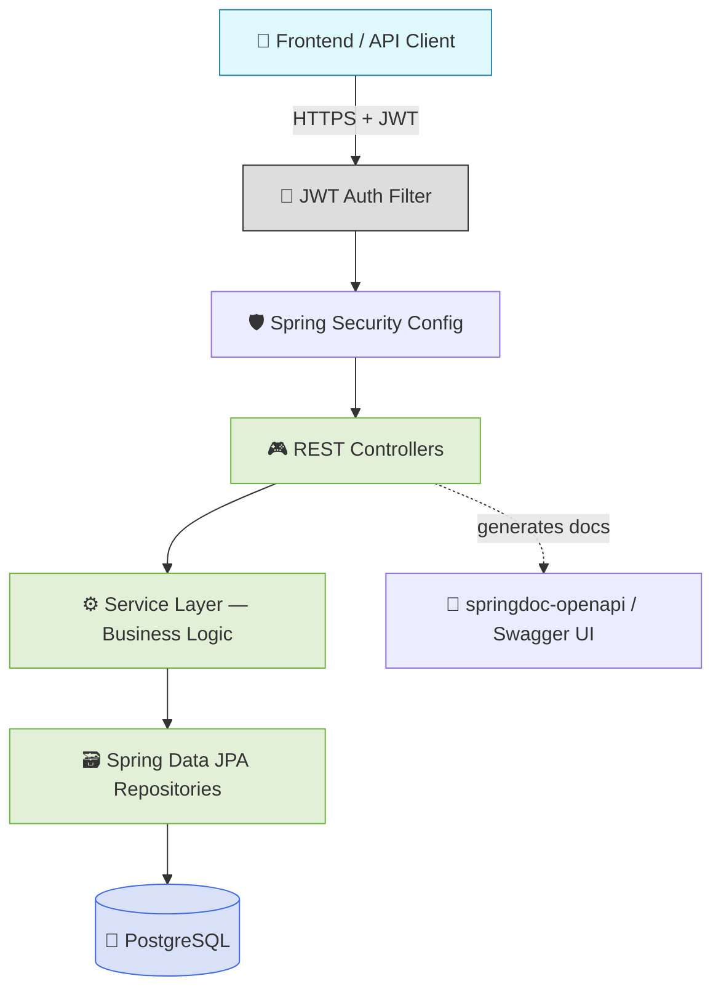
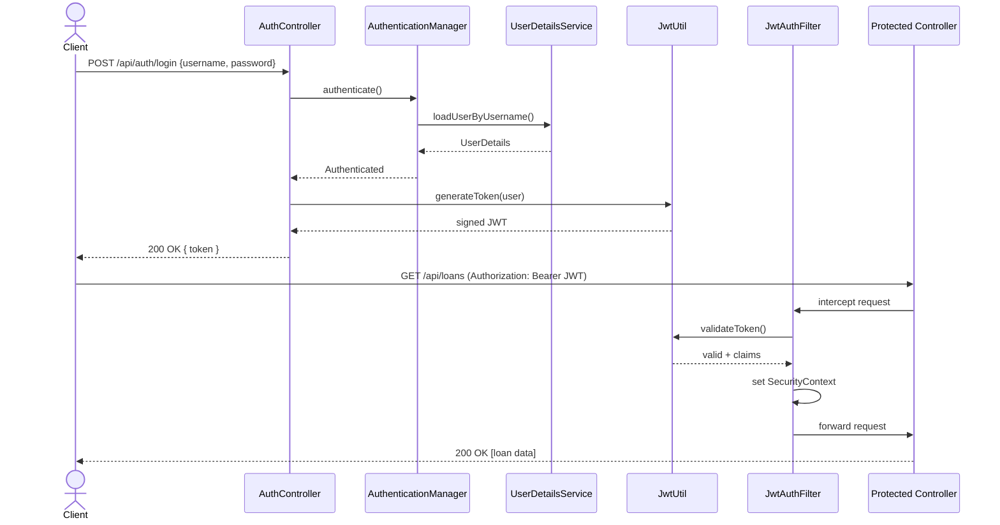
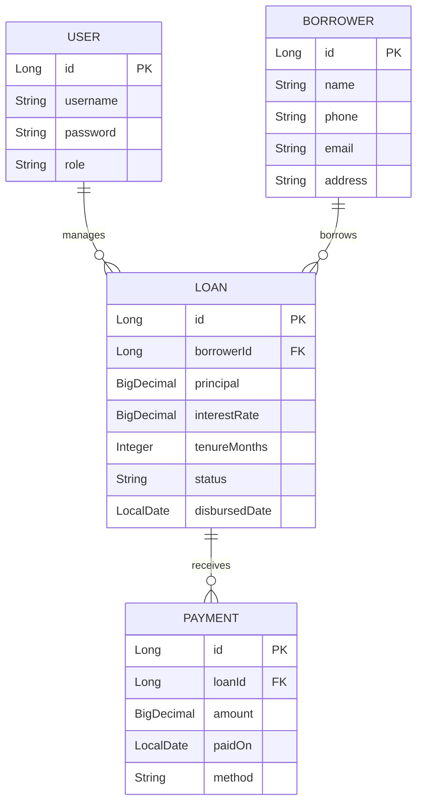
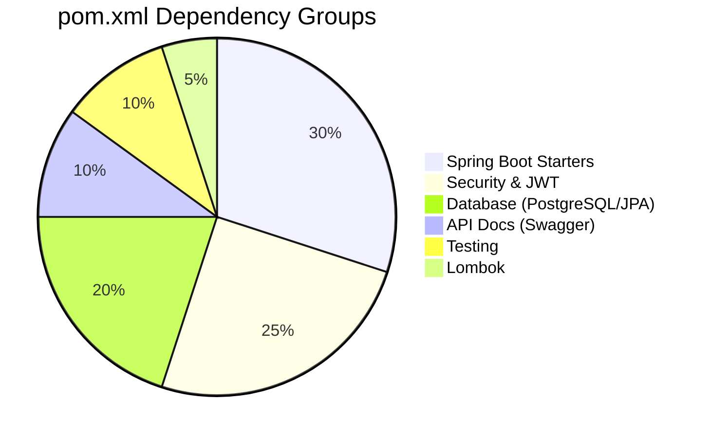
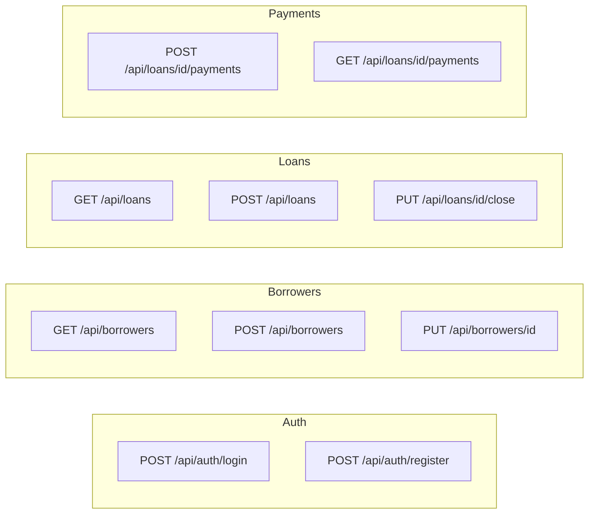

<div align="center">


<p>
  
  
  
  
  
  
</p>

<p>
  
  
  
  
</p>


</div>

---

## 📖 Overview

The **Money Ledging Backend** is a secure, layered REST API built with **Spring Boot 3.3.2** on **Java 17**. It powers borrower management, loan issuance, repayment tracking, and ledger reporting for the Money Ledging platform — protected end-to-end with **Spring Security + JWT**, documented via **Swagger/OpenAPI**, and shippable as a **Docker** image.

🔗 Consumed by: [Money_Ledging_Frontend](https://github.com/ashrithBalaji456/Money_Ledging_Frontend) → live at [money-ledging-frontend.vercel.app](https://money-ledging-frontend.vercel.app/)

---

## 🧱 Layered Architecture



---

## 🔐 Security & JWT Flow



---

## 🗂️ Entity Relationship Diagram



---

## 📁 Project Structure

```
Money_Ledging_Backend/
├── src/
│   └── main/
│       ├── java/com/example/lending/
│       │   ├── controller/       # REST endpoints
│       │   ├── service/          # Business logic
│       │   ├── repository/       # Spring Data JPA interfaces
│       │   ├── entity/           # JPA entities
│       │   ├── dto/              # Request/response DTOs
│       │   ├── security/         # JWT filter, config, security beans
│       │   ├── config/           # App & Swagger configuration
│       │   └── LendingApplication.java
│       └── resources/
│           └── application.properties
├── Dockerfile
├── pom.xml
└── .dockerignore
```

> Package layout above follows standard Spring Boot conventions for this stack — confirm against `src/` for exact naming.

---

## ⚙️ Tech Stack

| Layer | Technology |
|---|---|
| Language | Java 17 |
| Framework | Spring Boot 3.3.2 |
| Security | Spring Security + JJWT (0.11.5) |
| Persistence | Spring Data JPA + PostgreSQL |
| Validation | Spring Boot Starter Validation |
| API Docs | springdoc-openapi (Swagger UI) 2.5.0 |
| Boilerplate | Lombok |
| Testing | Spring Boot Test + Spring Security Test |
| Build | Maven |
| Container | Docker |

---

## 📊 Dependency Breakdown



---

## 🚀 Getting Started

### Prerequisites
- Java 17+
- Maven 3.9+
- PostgreSQL 14+
- Docker (optional, for containerized runs)

### Run Locally

```bash
git clone https://github.com/ashrithBalaji456/Money_Ledging_Backend.git
cd Money_Ledging_Backend

# configure your DB credentials in src/main/resources/application.properties

./mvnw spring-boot:run
```

The API starts on `http://localhost:8080`
Swagger UI: `http://localhost:8080/swagger-ui.html`

### Run with Docker

```bash
docker build -t money-ledging-backend .
docker run -p 8080:8080 --env-file .env money-ledging-backend
```

### Environment Variables

| Variable | Description |
|---|---|
| `SPRING_DATASOURCE_URL` | PostgreSQL JDBC connection string |
| `SPRING_DATASOURCE_USERNAME` | DB username |
| `SPRING_DATASOURCE_PASSWORD` | DB password |
| `JWT_SECRET` | Secret key used to sign JWTs |
| `JWT_EXPIRATION` | Token expiry (ms) |

---

## 📡 Sample API Endpoints



> Exact routes are defined in the `controller/` package — the diagram above reflects the expected REST surface for this domain; verify against the live Swagger UI.

---

## 🧪 Testing

```bash
./mvnw test
```

Covers service-layer business logic and security-filter behavior using Spring Boot Test + Spring Security Test.

---

## 🤝 Contributing

```bash
git checkout -b feature/your-feature
git commit -m "feat: describe your change"
git push origin feature/your-feature
```
Then open a Pull Request against `main`.

## 📄 License

Add a `LICENSE` file (MIT recommended) to formalize usage terms.

---

<div align="center">

[](https://github.com/ashrithBalaji456/Money_Ledging_Frontend)
[](https://money-ledging-frontend.vercel.app/)


</div>
