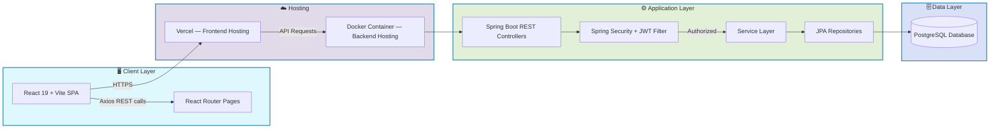
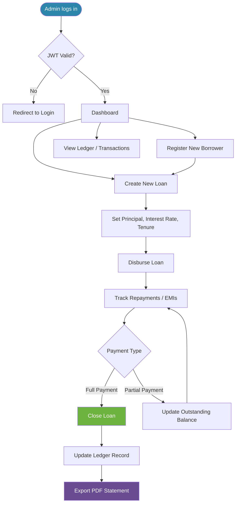
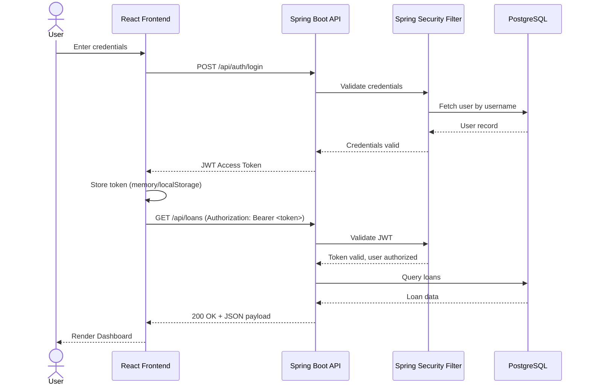
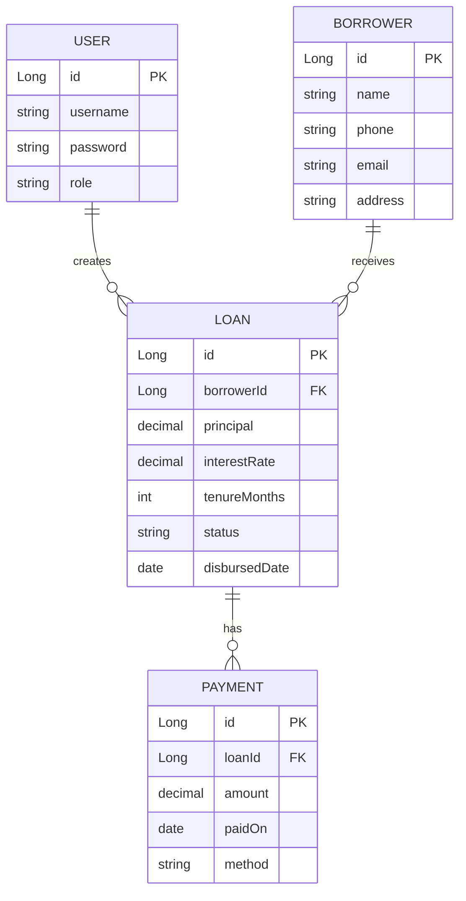
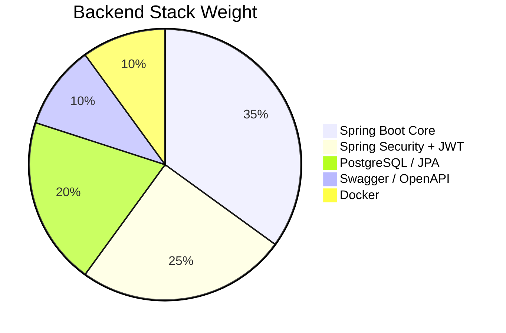
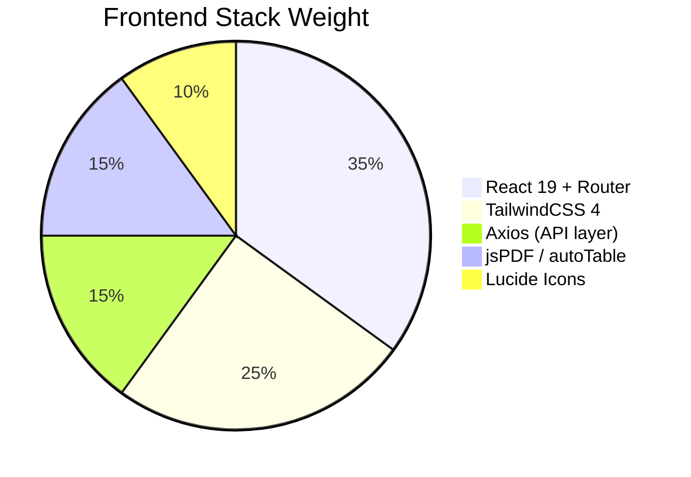
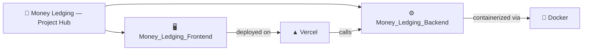

<div align="center">


<a href="https://money-ledging-frontend.vercel.app/">
  
</a>

<br/>

[](https://money-ledging-frontend.vercel.app/)

<p>
  
  
  
  
</p>

<p>
  
  
  
  
</p>

</div>

---

## 📖 About

**Money Ledging** is a full-stack money lending & ledger management platform. It lets an admin/lender register borrowers, issue loans, record repayments, and track outstanding balances — all backed by a secure Spring Boot API and a fast, modern React dashboard.

This repository serves as the **project hub** linking both codebases:

| Repo | Description | Link |
|---|---|---|
| 🖥️ **Frontend** | React 19 + Vite dashboard UI | [Money_Ledging_Frontend](https://github.com/ashrithBalaji456/Money_Ledging_Frontend) |
| ⚙️ **Backend** | Spring Boot REST API | [Money_Ledging_Backend](https://github.com/ashrithBalaji456/Money_Ledging_Backend) |
| 🌐 **Live App** | Deployed production build | [money-ledging-frontend.vercel.app](https://money-ledging-frontend.vercel.app/) |

> Each repo also ships its own detailed, animated `README.md` — see [`BACKEND_README.md`](#) and [`FRONTEND_README.md`](#) in this hub, or the linked repos directly.

---

## 🧩 System Architecture



---

## 🔄 Core Workflow — Loan Lifecycle



---

## 🔐 Authentication Sequence



---

## 🗂️ Data Model (High-Level ER Diagram)



> Field names above reflect the typical domain model for a lending/ledger system — see the backend repo for exact entity definitions.

---

## 📊 Tech Stack Composition





---

## ✨ Features

- 🔐 Secure JWT-based authentication & role-based access
- 👥 Borrower registration & profile management
- 💰 Loan creation with configurable principal, interest & tenure
- 📈 Repayment / EMI tracking with live outstanding balance
- 📒 Full ledger view of all transactions
- 🧾 One-click **PDF statement export** (via `jsPDF` + `jspdf-autotable`)
- 📑 Interactive API docs via Swagger / springdoc-openapi
- 🐳 Dockerized backend for consistent deployment
- ⚡ Instant, HMR-powered frontend dev experience via Vite

---

## 🛠️ Full Stack Setup

```bash
# 1. Clone both repos
git clone https://github.com/ashrithBalaji456/Money_Ledging_Backend.git
git clone https://github.com/ashrithBalaji456/Money_Ledging_Frontend.git

# 2. Run the backend (Spring Boot, Java 17, Maven)
cd Money_Ledging_Backend
./mvnw spring-boot:run
# API available at http://localhost:8080

# 3. Run the frontend (React + Vite)
cd ../Money_Ledging_Frontend
npm install
npm run dev
# App available at http://localhost:5173
```

> Full environment variable references, Docker instructions, and deep-dive docs live in each repo's own README (linked above).

---

## 🧭 Repository Map



---

## 🗺️ Roadmap

- [x] JWT authentication
- [x] Loan & borrower CRUD
- [x] PDF ledger export
- [ ] Email/SMS repayment reminders
- [ ] Multi-currency support
- [ ] Role-based dashboards (Admin / Agent)
- [ ] Analytics dashboard with charts

---

## 🤝 Contributing

Contributions are welcome on either repo! Fork, create a feature branch, and open a PR against `main`.

```bash
git checkout -b feature/your-feature
git commit -m "feat: add your feature"
git push origin feature/your-feature
```

## 📄 License

This project is available for personal and educational use. Add a `LICENSE` file to either repo to formalize terms (MIT recommended).

---

<div align="center">

### 🔗 Quick Links

[](https://github.com/ashrithBalaji456/Money_Ledging_Backend)
[](https://github.com/ashrithBalaji456/Money_Ledging_Frontend)
[](https://money-ledging-frontend.vercel.app/)


</div>
